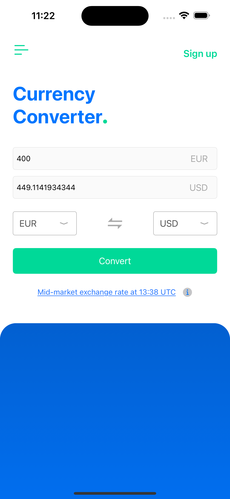
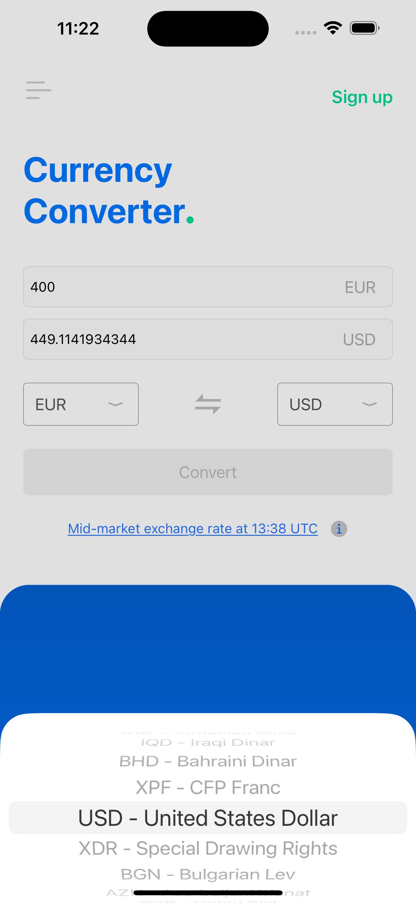

# cowry-take-home

ℹ️ Take home project for Cowrywise

## Libraries Used
- Alamofire
- SwiftyJSON
- Realm

## Preview

## Screenshots

## Installation

Setup Carthage

- After checking out project
run "carthage bootstrap"

- To upgrade dependencies (For iOS Platform only)
run "carthage update -platform iOS --use-xcframeworks"
